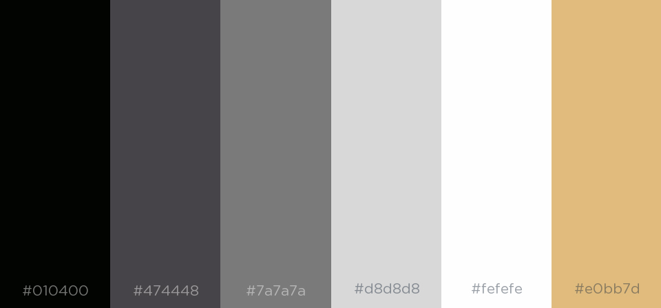

 <h1>Journal Tissi-Filippi</h1> 

# 10 maggio 2019

* Creazione gruppo e impostazione di VS Code.

* Creazione Journal.md

* Possibili idee di oggetti:
    - Divano --> modello mappato trovato (.max)
    - Lampada --> modello mappato trovato (.max)
    - Casco --> modello mappato trovato (.blend)
    - Sgabello --> modello mappato trovato (.blend)
    - Scarpa --> modello blender (.blend)

# 11 - 13 maggio 2019

 * Revisione del Journal trascritto la giornata precedente.

 * DECISIONE: sgabello.blend :

   

   - Il modello dello sgabello è stato scaricato dal web e successivamente modificato nel programma Blender 
   - La mappatura UV è "unvwrapped"
   - Mantenuto solo un file .blend e rimozione degli altri non rilevanti ai fini del progetto (ad esempio rimozione di tutte le texture e   del cycle-blend)
   - Abbiamo deciso di preferire questo agli altri per la maggiore adattabilità alla modifica dei materiali e dei colori.

 * Idee: possiamo fare in modo che l'utente possa scegliere due materiali diversi per la seduta dello sgabello e per la struttura che lo    riveste.

 * Analisi individuale di vari siti e decisione di creare due wireframe in modo separato. Di seguito verranno presentati entrambi.

  
 
  

 * Dopo aver concluso, ci siamo confrontati e abbiamo concordato la linea da seguire per la creazione di un wireframe coerente con   
  quanto precedentemente deciso.

 # 14 maggio 2019
 

 * Revisione del Journal trascritto la giornata precedente.
 
 * Breve discussione sui colori del sito e generazione di alcune palette di colori che verranno utilizzate.

 * Creazione della barra seguendo il progetto su carta

 * Generazione del logo usando il programma Adobe Photoshop ed inserimento di quest'ultimo all'interno della barra.

 * Realizzazione della parte inferiore della pagina dove spicca il logo contornato dalle icone dei principali social.

 * Scrittura del _path_ che dalla home ci siamo immaginati l'utente abbia percorso per arrivare nella pagina appena visualizzata.

 * DECISIONE e discussione relativa al termine _personalization_ ; quest'ultimo è stato sostuito dal termine _model_ all'interno della    
   barra.

 # 15 maggio 2019

 * Revisione del Journal trascritto la giornata precedente.

 * Creazione del menù nel lato destro della schermata e discussione sul colore migliore. Chiaro/scuro

 * Modifica del file in blender e rimappatura del modello. MAPPATURA unwrapped con la tecnica dello srotolamento.

 * Pianificazione del lavoro da svolgere nei giorni seguenti.

 # 16 - 21 maggio 2019

 * Revisione del Journal trascritto la giornata precedente.

 * Esportazione del progetto in OBJ e problematiche relative alla divisione dei livelli della struttura.

 * Risoluzione dei problemi mediante l'uso della funzione _traverse_.

 * Generazione della palette dei colori presentata nella figura successiva.

   

 * Costruzione di un documento parallelo dove viene visualizzato il modello 3D dello sgabello.

 * Continuazione dello sviluppo del sito seguendo i principi definiti nella figura iniziale. Di seguito si riporta quanto svolto fino ad oggi.

  

# 22 maggio 2019

* Revisione del Journal trascritto la giornata precedente.

* Realizzazione della cubemap definitiva. Per la cubemap abbiamo utilizzato il seguente sito per acquisire il file in 4k. ( https://hdrihaven.com/hdri/?c=artificial%20light&h=royal_esplanade ). 
Dopodichè servendoci del sito ( https://matheowis.github.io/HDRI-to-CubeMap/ ) abbiamo trasformato l'immagine nella cubemap finale e la abbiamo inserita.

# 23 maggio 2019

* Revisione del Journal trascritto la giornata precedente.

* Completamento della grafica del sito con l'introduzione del pulsante di informazioni e delle misure relative all'altezza alla largehzza e alla profondità dello sgabello.

* DECISIONE: scelta dei colori coerenti alla palette scelta precedentemente

* Posizionato il modello nella scena

* RICORDARE: possibilità di scelta per l'utente immagine di sfondo o bianco

# 28 maggio 2019

* Revisione del Journal trascritto la giornata precedente.

* Codice del vertex shader e del fragment shader e decisione sui materiali da utilizzare.

* TO DO:
  * scegliere tutte le texture
  * mettere le texture a tutti gli elementi
  * gestione dell'ambient light
  * gestione e aggiunta di nuove luci
  * implementare l'interattività al click

Sitting: 2 materiali (tessuto e pelle) -> 4 colori uguali per entrambi (rosso, nero, marrone, verde)

Sottocuscino è fisso NON MODIFICABILE di materiale LEGNO colore da noi deciso (vedi tex)

Struttura: 3 materiali (plastica, metallo e legno) 
-> metallo (colore non modificabile, meteriale riflettente abb) DISABILITO TUTTI I COLORI
-> plastica (rosso, nero, marrone chiaro, marrone scuro)
-> legno (marrone chiaro, marrone scuro)  DISABILITO I PRIMI DUE

TEXTURE CHE ABBIAMO PRONTE:
- cloth nero

# 1 giugno 2019

* Modello funzionante con texture inserite, migliorare resa estetica e inserimento delle luci

* Rimappatura del modello

* Aggiunta interattività con l'ambiente

# 3 giugno 2019

* Aggiunta di 3 luci posizionali

* TO DO:
  * scegliere texture migliori
  * posizionare luce ambientale

* NOTA: structure troppo "curvilinea", togliamo il legno come materiale?
  
  - Serve aggiungere gli stats? NO 
  - Mettere il simbolo dell'euro davanti alla cifra e non dietro
 
# 4 giugno 2019

Modifica della mappaura

TO DO OGGI:
 - cambiare le texture della plastica
 - posizionare le luci
 - envMap

