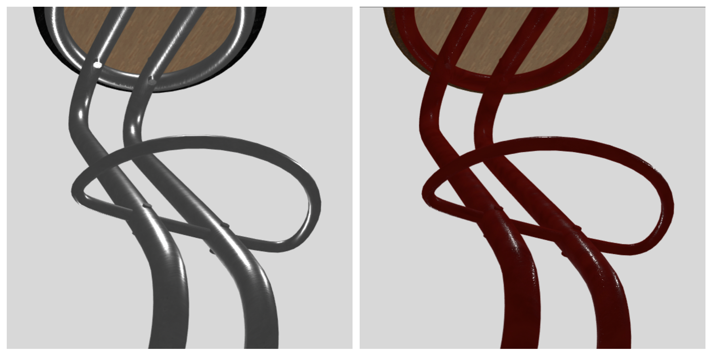

# Report Filippi - Tissi

Il progetto ha lo scopo di rappresentare un configuratore online interattivo per un sito di e-commerce commissionato dall'azienda "ACME". L'oggetto preso in considerazione in questo lavoro sarà uno sgabello.

Ci siamo prefissati di realizzare un sito web _professionale_, facendo attenzione alla scelta dei colori e uniformandoci al design dei siti web specializzati nel campo dell'arredamento; per renderlo il più universale possibile abbiamo utilizzato l'inglese come lingua di navigazione. Abbiamo innanzitutto creato un wireframe su carta del sito web nwel quale abbiamo inserito gli elementi più importanti. Di seguito forniamo il risultato:

 

Dopodichè siamo passati alla scelta dei colori. Per fare ciò abbiamo utilizzato il generatore di palette offerto dal sito _coolors.co_. Abbiamo deciso di aggiungere un ulteriore colore ai cinque generati dal sito. Di seguito forniamo la palette utilizzata:

 

La scelta è ricaduta su questi colori poichè l'idea era quella di ricreare un sito elegante e facilmente usabile. 

Siamo poi passati alla scelta del font. Dato che le quantità di testo sono ridotte e abbiamo principalmente titoli abbiamo scelto un font che si adattasse a questo uso e la scelta è ricaduta su _Poppins_ con diversi pesi.

Nel footer della pagina abbiamo inserito degli spazi destinati ai social per permettere all'utente di visitare le varie pagine dell'azienda. Abbiamo inoltre introdotto un pulsante _i_ che fornisce all'utente informazioni sul prodotto che sta visualizzando per favorirne l'eventuale acquisto.

La decisione sulla scelta del modello è ricaduta su uno sgabello che soddisfava le limitazioni inserite nella consegna (low-poly); inoltre si prestava bene a una scomposizione in più parti e ci dava la possibilità di introdurre vari materiali. 

Il modello dello sgabello è stato modificato con il programma "Blender"; la mappatura delle varie parti è stata fatta da noi. Abbiamo rimosso la mappatura di tipo "unwrapped" e abbiamo introdotto la "Cube_projection".

Di seguito illustreremo la personalizzazione che abbiamo deciso di offire ai fruitori del sito:

* **Seduta**: è possibile esprimere una preferenza tra due materiali (pelle e stoffa) e per ognuno si può individuare il colore più adatto tra i colori proposti nella barra sottostante.

* **Sottocuscino**: non è personalizzabile e viene inserito di default. Abbiamo preso questa decisione poichè abbiamo notato che l'eventuale scelta non avrebbe condizionato e portato modifiche di rilievo al progetto.

* **Struttura**: può essere in metallo, in plastica oppure in legno. Per quanto riguarda il metallo abbiamo deciso di non permettere all'utente di scegliere un'eventuale personalizzazione del colore, in quanto abbiamo scelto il metallo come materiale "elegante" e altri colori non ci sembravano adatti. Discorso diverso per la plastica e il legno: per quanto riguarda la prima è possibile esprimere una preferenza sulla colorazione tra 4 colori, mentre sono disponibili due diversi tipi di legno (uno più chiaro e uno più scuro).

Si è deciso di introdurre 4 luci puntuali che illuminano l'oggetto; durante la fase di progettazione esse sono state mantenute visibili, mentre abbiamo deciso di commentare la riga nella quale venivano introdotte nella scena.

Sono state posizionate prendendo spunto sia da immagini presenti su Google nelle quali veniva messa in evidenza la posizione della luce rispetto al prodotto, sia per far sì che forme, colori e materiali rendessero al meglio.

Inoltre è stata introdotta anche una _ambient light_ con l'AO map.

# Metodo di lavoro 

Abbiamo deciso di mantenere lo stesso metodo di lavoro che abbiamo seguito con lo sviluppo del primo progetto; il processo di creazione dell'elaborato finale aggiornato, di giorno in giorno, si trova nel file _Journal.md_. 

Per una migliore gestione del lavoro abbiamo deciso di servirci anche del programma _GitKraken_.

Abbiamo utilizzato il metodo _perturbNormal2Arb_ utilizzato nel file _l16_NormalMapping.html_ presente nel repository del 2018: questo perchè il calcolo delle normali di quest'anno ci creava problemi su dispositivi diversi in quanto ci forniva delle visualizzazioni diverse tra loro.

# Presentazione della strutturazione delle cartelle

Il progetto ha avuto inizio a partire dal codice visto in classe durante gli esempi (contenuto nelle slides).

Di seguito presentiamo l'organizzazione che abbiamo scelto per le cartelle durante il progetto:

* Il file denomianato _index.html_ contiene il vertex shader, il fragment shader e il codice html usato per lo sviluppo del sito.
* La cartella _styles_ contiene il file _style.css_ che abbiamo usato per personalizzare lo stile del sito web e il file _w3css.css_, framework del w3c reperibile al link https://www.w3schools.com/w3css/.
* La cartella _scripts_ contiene il file _main.js_ che contiene tutti gli uniform per i materiali e varie funzioni, come calcPrice() per calcolare il prezzo finale del prodotto.
* La cartella _models_ contiene due file: il primo è denominato _SgabelloSeparato.blend_ con il quale abbiamo modificato, mappato il modello e generato il secondo file denominato _SgabelloCompleto.obj_ utilizzato per caricare il modello.
* La cartella _textures_ contiene la cubeMap (Che non è stata inserita nel progetto) e la cartella con tutti i materiali introdotti nel progetto. Le varie texture sono state create a partire dalle sostanze disponibili sul sito https://www.cc0textures.com utilizzando il programma fornito da Allegorithmic (Bitmap2Material) che genera texture con una dimensione adatta alla visualizzazione sul web. Sono state usate: normalMap, roughnessMap, specularMap, diffuseMap e aoMap.
Per facilitarci il lavoro, abbiamo deciso di caricare tutte le texture allo stesso momento all'avvio del sito, tuttavia siamo consapevoli che ciò è poco efficiente e la soluzione migliore sarebbe quella di caricarle solo una volta richieste.

* La BRDF utilizzata è quella speculare. Il codice è stato scritto partendo da quello presente nel file __l17-shadingWithAO.html__, è stato poi riadattato per permettere l'uso di più luci puntuali. 

# Risultato finale

L'immagine che segue rappresenta l'elaborato finale del nostro lavoro.

 

 

Alcuni esempi di configurazioni possibili:

 
 
 